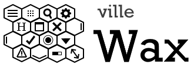

<!-- PROJECT LOGO -->
 

  

  <h3 align="center"></h3>

  

    One code base, multiple platforms
  

<!-- ABOUT THE PROJECT -->
## About The Project
Hooked on a feeling that a single project (codebase) can be used to build applications for multiple platforms (the ones that matter).

**Goals**
* qx.Desktop based controls that fit and work well in the web, desktop and mobile UI UX paradigms
* Multiple projects/demos/examples that fit various UI UX scenarios
* Skeleton (template) based - all projects have an associated application skeleton

**Screen Shots**
In progress

<!-- GETTING STARTED -->
**Getting started:**
In progress

<!-- DEMO -->
## Demo
In progress
[Qooxdoo Playground](http://qooxdoo.org/qxl.playground/#%7B%22code%22%3A%22var%2520button1%2520%253D%2520new%2520qx.ui.form.Button(%2522Add%2520content%2520to%2520scroller%2520and%2520slider%2522)%253B%250Avar%2520doc%2520%253D%2520this.getRoot()%253B%250Adoc.add(button1%252C%250A%257B%250A%2520%2520left%2520%253A%2520100%252C%250A%2520%2520top%2520%2520%253A%252050%250A%257D)%253B%250A%250A%252F%252F%2520Scroller%250Avar%2520scroller%2520%253D%2520new%2520qx.ui.container.Scroll()%253B%250Ascroller.set(%257B%250A%2520%2520width%2520%253A%2520100%252C%250A%2520%2520maxHeight%2520%253A%2520300%252C%250A%2520%2520allowGrowY%253A%2520true%250A%257D)%250Adoc.add(scroller%252C%2520%257B%250A%2520%2520left%2520%253A%2520100%252C%250A%2520%2520top%2520%2520%253A%2520100%250A%257D)%250Avar%2520container%2520%253D%2520new%2520qx.ui.container.Composite(new%2520qx.ui.layout.VBox()).set(%257BallowGrowY%253A%2520true%257D)%253B%250Ascroller.add(container)%253B%250A%250A%252F%252F%2520Slider%250Avar%2520slideBar%2520%253D%2520new%2520qx.ui.container.SlideBar(%2522vertical%2522)%253B%250AslideBar.set(%257B%250A%2520%2520width%2520%253A%2520100%252C%250A%2520%2520maxHeight%2520%253A%2520300%250A%257D)%250Adoc.add(slideBar%252C%2520%257B%250A%2520%2520left%2520%253A%2520250%252C%250A%2520%2520top%2520%2520%253A%2520100%250A%257D)%250Avar%2520slideContainer%2520%253D%2520new%2520qx.ui.container.Composite(new%2520qx.ui.layout.VBox())%253B%250AslideBar.add(slideContainer)%253B%250A%250Avar%2520scrollerpane%2520%253D%2520scroller.getChildControl(%2522pane%2522)%253B%250A%250Ascrollerpane.addListener(%2522update%2522%252C%2520function(e)%250A%2520%2520%2520%2520%257B%250A%2520%2520%2520%2520%2520%2520var%2520content%2520%253D%2520scrollerpane.getChildren()%255B0%255D%253B%250A%2520%2520%2520%2520%2520%2520if%2520(!content)%2520%257B%250A%2520%2520%2520%2520%2520%2520%2520%2520return%253B%250A%2520%2520%2520%2520%2520%2520%257D%250A%250A%2520%2520%2520%2520%2520%2520var%2520innerSize%2520%253D%2520scrollerpane.getInnerSize()%253B%250A%2520%2520%2520%2520%2520%2520var%2520contentSize%2520%253D%2520content.getBounds()%253B%250A%2520%2520%2520%2520%2520%2520scroller.setHeight(contentSize.height)%253B%250A%250A%2520%2520%2520%2520%257D%250A)%253B%250A%250A%250A%250Abutton1.addListener(%2522execute%2522%252C%2520function(e)%2520%257B%250A%2520%2520%252F%252F%2520add%2520to%2520scroller%250A%2520%2520var%2520widget%2520%253D%2520new%2520qx.ui.core.Widget()%253B%250A%2520%2520widget.set(%257B%250A%2520%2520%2520%2520height%2520%253A%2520101%252C%250A%2520%2520%2520%2520width%2520%253A%2520100%252C%250A%2520%2520%2520%2520backgroundColor%2520%253A%2520%2522blue%2522%250A%2520%2520%257D)%250A%2520%2520container.add(widget)%253B%250A%2520%2520scrollerpane.fireEvent(%2522update%2522)%253B%250A%2520%2520%250A%2520%2520%252F%252F%2520add%2520to%2520slider%250A%2520%2520var%2520sliderWidget%2520%253D%2520new%2520qx.ui.core.Widget()%253B%250A%2520%2520sliderWidget.set(%257B%250A%2520%2520%2520%2520height%2520%253A%2520101%252C%250A%2520%2520%2520%2520width%2520%253A%2520100%252C%250A%2520%2520%2520%2520backgroundColor%2520%253A%2520%2522blue%2522%250A%2520%2520%257D)%250A%2520%2520slideContainer.add(sliderWidget)%253B%250A%257D)%253B%250A%250A%250A%250A%250A%250A%22%2C%20%22mode%22%3A%22ria%22%7D)

<!-- ROADMAP -->
## Roadmap

**First Milestone - Pre 1.0 releases**
* qx.Desktop controls (widgets) that function well on mobile platforms
* A single project and corresponding skeleton that successfully builds to multiple platforms

<!-- LICENSE -->
## License

Distributed under the MIT License. See `LICENSE` for more information.

<!-- CONTACT -->
## Contact

Chris Eskew - [@SQville](https://twitter.com/SQville) - email: sqville@gmail.com