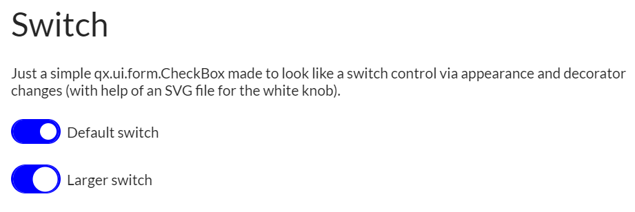
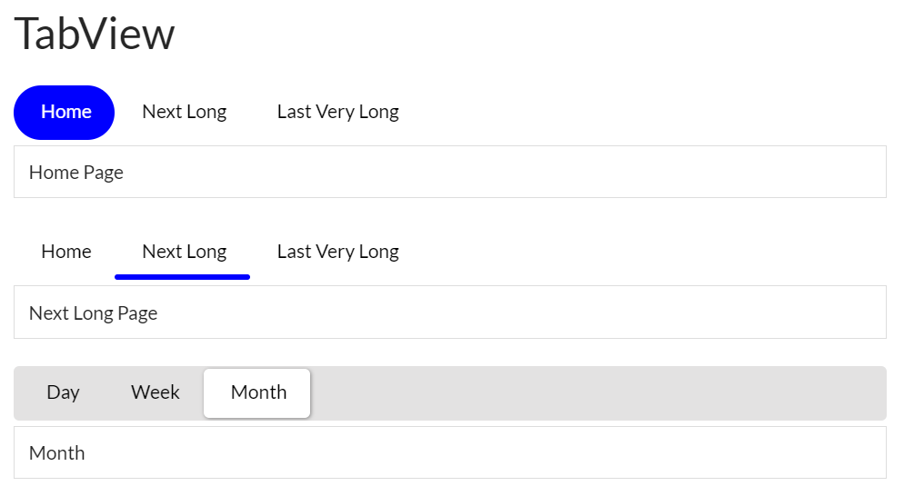
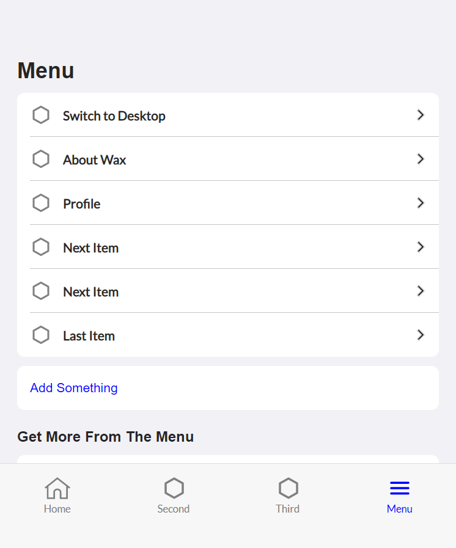

<!-- PROJECT LOGO -->
 

  

  <h3 align="center"></h3>

  

    One code base, multiple platforms
  

<!-- ABOUT THE PROJECT -->
## About The Project
Hooked on a feeling that a single project (codebase) can be used to build applications for multiple platforms.

**Goals**
* qx.Desktop based controls that fit and function well in the web, desktop and mobile UI UX paradigms
* Multiple projects/demos/examples that fit various UI UX scenarios
* Skeleton (template) based - all projects have an associated application skeleton

**Screen Shots**
 

 
 

  
Mobile UI
 

<!-- GETTING STARTED -->
**Getting started:**
In progress

<!-- DEMO -->
## Demos
The Wax Control Showcase 

<!-- ROADMAP -->
## Roadmap

**First Milestone - Pre 1.0 releases**
* Release qx.Desktop control (widgets) enhancements to benefit the community and start conversations

**Next Milestone - 1.0 Release**
* Compile, build and deploy process that supports web and mobile
* One base Skeleton
* qx.Desktop widgets that function well on mobile devices  

<!-- LICENSE -->
## License

Distributed under the MIT License. See `LICENSE` for more information.

<!-- CONTACT -->
## Contact

Chris Eskew - [@SQville](https://twitter.com/SQville) - email: sqville@gmail.com